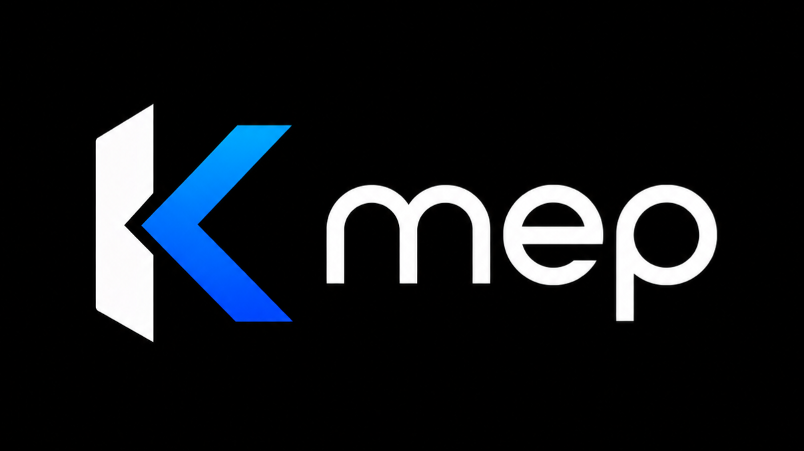

<p align="center">
  
</p>

<p align="center">
  <a href="https://github.com/dipodev20/kmep/actions/workflows/dart_ci.yml">
    
  </a>
</p>

<p align="center">
  <a href="LICENSE"></a>
  <a href="https://pub.dev/packages/kmep"></a>
  <a href="https://pub.dev/packages/kmep"></a>
  <a href="https://pub.dev/packages/kmep"></a>
  <a href="https://pub.dev/packages/kmep"></a>
  <a href="https://github.com/dipodev20/kmep/stargazers"></a>
</p>

<p align="center">
  <a href="https://github.com/dipodev20/kmep">
    
  </a>
</p>

<br />

# KMEP: Dart YouTube Extractor — A Stable Alternative to NewPipe

KMEP is a YouTube extraction library written in pure Dart, built as a
stable alternative to NewPipeExtractor for Flutter and Dart apps. It
talks to the same InnerTube endpoints YouTube's own apps use —
multi-client fallback, real `player.js` execution for signatures,
on-device BotGuard PO tokens — behind a typed Dart API, with no JVM,
no Python runtime, and no backend server.

The short version of why it exists: if you're building a Dart app and
want YouTube data without a JVM dependency, a Python runtime, or your
own server, your options were thin. Now they aren't.

```dart
final kmep = Kmep.withOnDevicePoToken(
  jsRuntime: myPlayerJsRuntime,
  potJsRuntime: myBotGuardRuntime, // a *separate* JS context
  fetchText: (url) => http.get(Uri.parse(url)).then((r) => r.body),
);

final video    = await kmep.getVideo('dQw4w9WgXcQ');   // 27 streams, up to 4K
final results  = await kmep.search('lofi hip hop');
final channel  = await kmep.getChannel('UC-lHJZR3Gqxm24_Vd_AJ5Yw');
final playlist = await kmep.getPlaylist('PLFgquLnL59alCl_2TQvOiD5Vgm1hCaGSI');
final comments = await kmep.getComments('dQw4w9WgXcQ'); // threads + replies
```


## How it actually works

Extraction breaks down into three problems, each with its own machinery:

**1. Getting stream URLs.** YouTube serves different data to different
pretend-clients, and they break independently. KMEP tries them in a
calibrated order — `ANDROID_VR` (keyless, direct URLs, no player.js
needed), then `WEB`, `IOS`, `WEB_SAFARI`, `TV` — and falls through on
failure. The order isn't guesswork: it was measured against live
traffic, and it's tunable at runtime via `RemoteConfig` (which your app
can fetch from anywhere, so a client breaking overnight doesn't mean
shipping an app update).

**2. Untangling signatures.** Browser clients return URLs with a
poisoned `n` parameter that throttles playback to ~70 Kbps until
reversed. The only reliable way to reverse it is to run YouTube's own
`player.js` — KMEP does exactly that, in a real JS engine you provide
(`WebViewJsRuntime` on Flutter, `NodeProcessJsRuntime` on a server).
QuickJS-based runtimes were tried first; they crash on `player.js`
non-deterministically, which is why WebView is the recommended one.

**3. PO tokens.** Some clients now refuse to serve stream URLs without
a BotGuard attestation token. The standard solution is a sidecar
server (bgutil). KMEP generates the token **on the device** — the same
BotGuard program YouTube's own web client runs, executed in your JS
runtime, with no server and no third party. This was the hardest part
of the project and the reason the license is what it is.

Search, channels, playlists and comments don't need any of that
machinery — they ride the tolerant unauthenticated WEB client, which
is why they work everywhere including plain CLI scripts.

## What's covered

| | Feature | Notes |
|---|---|---|
| 🎬 | Video + stream URLs | up to 4K, all 27 formats, live/HLS |
| 🛡️ | Multi-client fallback | 5 clients, runtime-tunable priority |
| 🔏 | Signature / `n` resolution | real `player.js` execution |
| 🤖 | PO token generation | on-device BotGuard, zero servers |
| 🔍 | Search | typed results, paginated |
| ⚡ | Shorts feed | same search surface, shorts-only filter |
| 📺 | Channels | header, tabs, videos, shorts/live tabs |
| 📃 | Playlists | header + full pagination |
| 💬 | Comments | top/newest, pages, thread replies, pinned/hearted |

Not covered (on purpose): other sites — there's no multi-service
abstraction layer, YouTube's surface alone is enough work for one
library.

## Why not just use NewPipeExtractor?

NewPipeExtractor is a great library — and if you're on the JVM, use it.
KMEP exists because it isn't:

- **NewPipeExtractor is JVM** (Java/Kotlin). In a Flutter app that
  means shipping a JVM runtime or building platform bridges per OS —
  the heaviest dependency an otherwise pure-Dart app can take.
- **KMEP is a plain Dart dependency.** One `pubspec.yaml` line, one
  import, no codegen, no platform channels of your own.
- **On-device PO tokens, built-in.** KMEP runs the actual BotGuard
  program on-device — no bgutil server, no third-party attestation
  service. Nothing external to deploy, keep alive, or hide from users.
- **Client matrix is runtime-tunable.** When YouTube breaks a client,
  the fix is usually a config override fetched over the air
  (`RemoteConfig`), not an app release.
- **Complements, not competes:** KMEP's production router falls back
  to NewPipeExtractor on failure — the two are designed to coexist.

## How to use KMEP as a FreeTube alternative (building blocks)

FreeTube and LibreTube are apps; KMEP is the engine you'd build one
with. A minimal "browse + watch" Flutter app is a weekend of work:

```dart
// Search → results → channel page → playlist → comments: all typed.
final results = await kmep.search('flutter tutorial');
final shorts  = await kmep.shortsFeed(query: 'lofi');
final channel = await kmep.getChannel('@flutterdev');
final videos  = await kmep.getChannelVideos(channel.channelId);
final playlist = await kmep.getPlaylist('PLjxrf9hq8sD5U0z-xY8ELwlJ71QusK16N');

// The watch experience: full metadata + resolved, playable stream URLs.
final video = await kmep.getVideo(videos.first.videoId);
final best = video.streams
    .where((s) => s.type == 'video')
    .reduce((a, b) => (a.height ?? 0) >= (b.height ?? 0) ? a : b);
// hand best.url to your player (video_player, media_kit, exoplayer…)
```

If you want the ready-made app instead: NewPipe, LibreTube and
FreeTube exist and are excellent. If you want to build *your own* —
with your own UI, caching, and offline behavior — that's exactly the
job KMEP was extracted for.

## Comparison with yt-dlp, NewPipe, and LibreTube

| | **KMEP** | NewPipeExtractor | yt-dlp | NewPipe / LibreTube / FreeTube |
|---|---|---|---|---|
| What it is | Dart library | JVM library | Python CLI/library | End-user apps |
| Language | **Dart** | Java/Kotlin | Python | Kotlin/JS/Vue |
| Runs inside a Flutter app | **natively, one dependency** | via JVM/bridges | via server or Python runtime | n/a |
| PO token strategy | **on-device BotGuard, zero servers** | not built-in | external bgutil server/plugin | per-app |
| Client fallback when YouTube changes | 5 clients + **runtime RemoteConfig** | per-release fixes | per-release fixes | per-release fixes |
| Search / channels / playlists / comments | **typed Dart API** | extractor objects | CLI/JSON | built-in UI |
| Video quality | up to 4K, all 27 formats | up to 4K (client-dependent) | all formats | client-dependent |
| Live streams / HLS | yes | yes | yes | yes |
| Production track record | 4–5 weeks daily-driver app, 98% (49/50) | battle-tested for years | industry standard | battle-tested for years |
| License | GPL-3.0-or-later | GPL-3.0 | Unlicense | various (mostly GPL) |

The fair reading of that table: for JVM projects NewPipeExtractor is
the safer bet, and for servers yt-dlp is unbeatable. KMEP's niche is
**Flutter/Dart apps that want the extraction engine in-process** —
that combination had no production-tested option before this.

## How to install and use KMEP

**1. Depend on it** — published on pub.dev:

```yaml
dependencies:
  kmep: ^0.3.0
```

(or via git, if you need unreleased changes:)

```yaml
dependencies:
  kmep:
    git:
      url: https://github.com/dipodev20/kmep
      path: dart
```

**2. Provide a JS runtime** (the one platform-specific piece — see
[Platform integration](#platform-integration) below) and an HTTP
fetcher, then construct the facade:

```dart
import 'package:kmep/kmep.dart';

final kmep = Kmep.withOnDevicePoToken(
  jsRuntime: WebViewJsRuntime(),        // player.js execution
  potJsRuntime: WebViewJsRuntime(),     // separate JS context for BotGuard
  fetchText: myHttpGetText,
);
```

**3. Call it.** Every method returns typed Dart models — no JSON
munging:

| Call | Returns |
|---|---|
| `getVideo(id)` | `VideoInfo` + playable `KMEPStream` list |
| `search(q)` / `shortsFeed(q)` | typed, paginated results |
| `getChannel(idOrHandle)` | `ChannelInfo` (avatar, banner, subs, tabs) |
| `getChannelVideos(id)` | paginated video cards |
| `getPlaylist(idOrUrl)` | `PlaylistInfo` + first page |
| `getComments(id, sort: top/newest)` | threads, replies, pinned/hearted |
| `getCommentReplies(token)` | thread replies, paginated |

Full runnable example: [`dart/example/example.dart`](dart/example/example.dart).

## Platform integration

KMEP needs a `JsRuntime` from you — something that can execute a real
`player.js`. Deliberately not bundled, because the right answer
differs per platform:

- **Flutter 📱** — `WebViewJsRuntime` from [`flutter_integration/`](flutter_integration)
  in this repo. This is the production-tested one; QuickJS-based
  runtimes choke on `player.js` intermittently.
- **Server / CLI 🖥️** — `NodeProcessJsRuntime` (in `dart/lib/src/runtimes/`)
  shells out to a local `node` binary.
- **Anything else 🔧** — implement two methods (`bootstrap`, `call`)
  and you're in.

Full wiring lives in `dart/lib/src/kmep_client.dart` doc comments and
`dart/example/example.dart`.

## Performance, measured

Numbers from a mid-range Android device, residential IP, same
`android_vr` client for both engines, September 2026:

| | yt-dlp 2026.08 | KMEP 0.3 |
|---|---|---|
| Cold: process start + one video | ~11.8 s | ~7–9 s (incl. player.js bootstrap) |
| Same video again | — | **~1 ms** (built-in cache) |
| Formats returned | 4 (with `best`) | 27 (everything YouTube serves) |
| Runs inside a Flutter app | no (process/server) | yes (a Dart object) |

Reproduce it yourself: `dart run tool/bench_kmep.dart` in this repo,
and the matching yt-dlp command is documented in the same file. Both
engines fail on the same bot-checked videos on this IP — that part is
YouTube, not us.

## Honest limitations

Read this before betting a product on it:

- **IP reputation is the ceiling.** When YouTube decides your datacenter
  or VPN IP is a bot, no extractor saves you — not this one, not
  yt-dlp, not NewPipe. The 98% success rate below was measured from a
  residential mobile IP. On hostile IPs, everything degrades together.
- **YouTube changes things** every few weeks. When a client breaks, the
  fix here is usually config, not code (client versions live in
  `ClientRegistry` and can be overridden via `RemoteConfig` without a
  release), but "usually" isn't "always".
- **`player.js` needs a real JS engine.** In a Flutter app that's a
  headless WebView (provided). In plain Dart, a `node` binary. There's
  no interpreter bundled — by design, since the right engine differs
  per platform.
- **Pre-1.0.** The API moved between 0.2 and 0.3 (renamed package,
  restructured models). Expect another shift or two before 1.0.

## Production track record

This isn't a weekend proof-of-concept. The extraction core has been the
default engine of the [Vidora][vidora] Android app for over a month of
daily use: **49 out of 50 videos extracted successfully (98%)** in a
live-audited run, zero crashes, and the router falls back to
NewPipeExtractor on the rare failure — so users never see an error
they can't work around. The full methodology, evidence trail, and the
honest list of things that are still fragile live in
[docs/AGENT_HANDOFF.md](docs/AGENT_HANDOFF.md), which is more current
than any marketing prose.

[vidora]: https://github.com/dipodev20

## FAQ

**Why not just use yt-dlp?** Use it — it's magnificent, and its client
research informed this project's client matrix. But it's Python:
"just bind it with ffigen/jnigen" doesn't work (ffigen is for C,
jnigen for JVM), and the real options are shipping a Python runtime
(80+ MB, process management) or running a server — which is exactly
the deployment KMEP exists to avoid. Different tools for different
shapes of problem.

**Why GPLv3 when yt-dlp is Unlicense?** Because this codebase is weeks
of reverse-engineering — on-device BotGuard, nsig discovery, client
calibration — and copyleft is the only thing that stops someone from
rebranding it closed-source. Same reasoning as NewPipe. If your
project can't carry GPL-3.0-or-later, yt-dlp is right there and it's
a great tool.

**What's `backend/` for, then?** An optional, unused-by-the-library
emergency fallback: a tiny FastAPI service that shells out to yt-dlp
when every on-device client fails (think hostile IP, no POT). The
library never imports it; it exists because it documented the survival
path during the prototype phase. One Python file — delete it and
nothing changes.

## Legal

KMEP talks to YouTube's undocumented InnerTube API — the same surface
NewPipeExtractor and yt-dlp use. Whether that's okay under YouTube's
ToS depends on jurisdiction and deployment; that risk belongs to
whoever ships it, as with every extractor. This repository contains
no YouTube content, credentials, or API keys — only client-side logic
for endpoints YouTube's own apps already call.

## License

GPL-3.0-or-later — see [LICENSE](LICENSE). Free to use, study, modify
and redistribute, **including commercially** — but derivatives must
stay open under GPLv3 and credit this project. Taking this code,
renaming it and shipping it closed is a copyright violation and will
be treated as one.

Built with the help of an AI agent working through
[docs/AGENT_HANDOFF.md](docs/AGENT_HANDOFF.md) — the evidence trail
behind every claim in this README.
